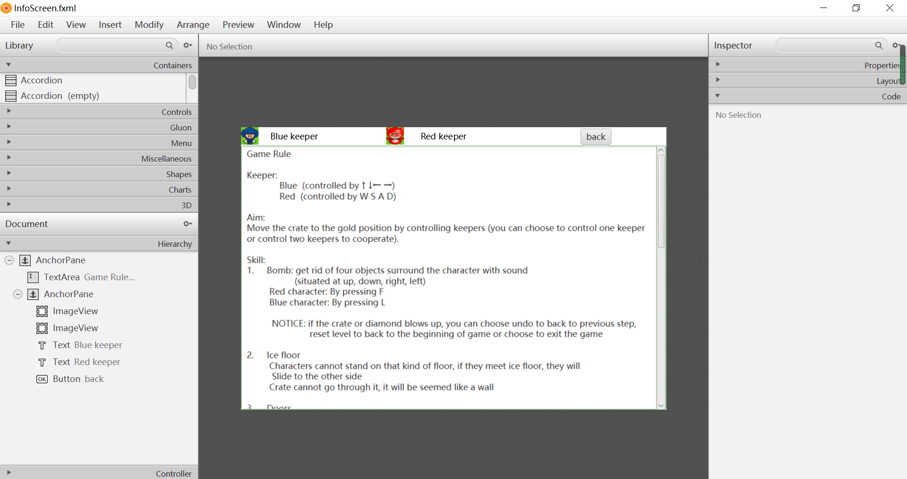
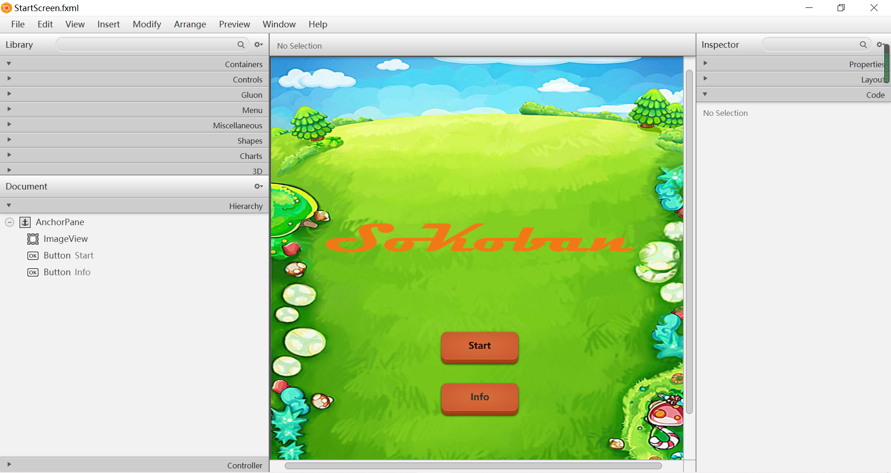
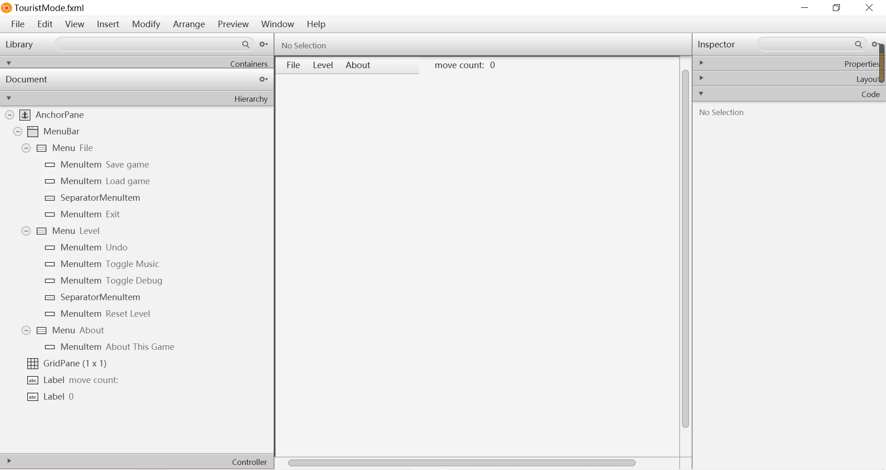

# AE2DMSCW-20126518

(word counts: 500		number of figures: 3)

[TOC]

## Refactoring

#### 1. OO design pattern

##### 		1.1 Factory Pattern 

​				**1.1.1 [event](https://csprojects.nottingham.edu.cn/ae2dms-cw-20126518/ae2dms-cw-20126518/-/tree/master/src/main/java/main/com.ae2dms/enums/eventFactory.java)**		

​						I applied factory design pattern for game events.

​						One `eventHandleInterface.java` interface, one `eventFactory.java` factory and 9 entities: closeGame, loadGame, resetLevel, saveGame, showAbout, showVictoryMessage, toggleDebug, toggleMusic and undo 

​				**1.1.2 [music](https://csprojects.nottingham.edu.cn/ae2dms-cw-20126518/ae2dms-cw-20126518/-/tree/master/src/main/java/main/com.ae2dms/enums/MusicFactory.java)**	

​						I applied factory pattern for two kinds of music: background music and bomb music.

​						One `Music.java` interface, one `MusicFactory.java` factory and 2 entities: backgroundMusic and bombMusic.

​				**1.1.3 [engine](https://csprojects.nottingham.edu.cn/ae2dms-cw-20126518/ae2dms-cw-20126518/-/tree/master/src/main/java/main/com.ae2dms/enums/engineFactory.java)**

​					I applied factory pattern to move functions:

​					One abstract class `Engine.java` , one factory `engineFactory.java` and three entities:  moveEngine, moveRedEngine and removeObject

#### 2. GUI design pattern 

I applied MVC for GUI design pattern.

##### 2.1 V - Version

​		**2.1.1 In InfoScreen.fxml view:**

​					

​		**2.1.2 In StartScreen.fxml view:**

​		

​		**2.1.3 In TouristMode.fxml view:**

​				

​			

##### 2.2 C - Controller

​		[InfoScreenController](https://csprojects.nottingham.edu.cn/ae2dms-cw-20126518/ae2dms-cw-20126518/-/tree/master/src/main/java/main/com.ae2dms/controller/InfoScreenController.java)

​		[StartScreenController](https://csprojects.nottingham.edu.cn/ae2dms-cw-20126518/ae2dms-cw-20126518/-/tree/master/src/main/java/main/com.ae2dms/controller/StartScreenController.java)

​		[TouristController](https://csprojects.nottingham.edu.cn/ae2dms-cw-20126518/ae2dms-cw-20126518/-/tree/master/src/main/java/main/com.ae2dms/controller/TouristController.java)

​		

#### 3. Refactoring methodologies

##### 3.1 Corrective Maintenance  -finding and fixing errors

​			**3.1.1 complete [toggle music](https://csprojects.nottingham.edu.cn/ae2dms-cw-20126518/ae2dms-cw-20126518/-/tree/master/src/main/java/main/com.ae2dms/entity/events/toggleMusic.java) function**

​						I use an integer variable `toggleMusicTimes` to count the click times.

​			**3.1.2 complete [undo](https://csprojects.nottingham.edu.cn/ae2dms-cw-20126518/ae2dms-cw-20126518/-/tree/master/src/main/java/main/com.ae2dms/entity/events/undo.java) function**					  

​						I use an `ArrayList<String>` to store all current levels and if user choose undo, remove the last element and assign the newly last element value to current level then reload game grid.

​			**3.1.3 complete [reset level](https://csprojects.nottingham.edu.cn/ae2dms-cw-20126518/ae2dms-cw-20126518/-/tree/master/src/main/java/main/com.ae2dms/entity/events/resetLevel.java) function**		

​						I use the `ArrayList<String>` created in undo 

​			**3.1.4 complete [save game](https://csprojects.nottingham.edu.cn/ae2dms-cw-20126518/ae2dms-cw-20126518/-/tree/master/src/main/java/main/com.ae2dms/entity/events/saveGame.java) function**			

​						I write the levels including current level and the remaining to a new `.skb` file.

​			**3.1.5 correct codes**

​						I corrected some codes for passing game levels.

​			**3.1.6 remove unused codes**

##### 3.2 Dividing all classes into packages

​			I divided whole program codes into four big packages: [controller](https://csprojects.nottingham.edu.cn/ae2dms-cw-20126518/ae2dms-cw-20126518/-/tree/master/src/main/java/main/com.ae2dms/controller), [entity](https://csprojects.nottingham.edu.cn/ae2dms-cw-20126518/ae2dms-cw-20126518/-/tree/master/src/main/java/main/com.ae2dms/entity), [enums](https://csprojects.nottingham.edu.cn/ae2dms-cw-20126518/ae2dms-cw-20126518/-/tree/master/src/main/java/main/com.ae2dms/enums) and [util](https://csprojects.nottingham.edu.cn/ae2dms-cw-20126518/ae2dms-cw-20126518/-/tree/master/src/main/java/main/com.ae2dms/util).

##### 3.3 using encapsulation

​		I made some fields to be private in a package.

##### 3.4 make classes have single responsibility

## Addition

#### 1. [high score](https://csprojects.nottingham.edu.cn/ae2dms-cw-20126518/ae2dms-cw-20126518/-/tree/master/src/main/java/main/com.ae2dms/entity/engine/findMin5MovesCount.java)		

​		A Top5 high scores dialog after each game level (5 minimum moves counts), and Top1 if there are less than 5 playing times.

#### 2. [start screen](https://csprojects.nottingham.edu.cn/ae2dms-cw-20126518/ae2dms-cw-20126518/-/tree/master/src/main/resources/fxml/StartScreen.fxml)	

​		A start screen with background and two button: Start, Info.

#### 3. [information screen](https://csprojects.nottingham.edu.cn/ae2dms-cw-20126518/ae2dms-cw-20126518/-/tree/master/src/main/resources/fxml/InfoScreen.fxml)

​		A screen shows how to play this game.

#### 4. [transfer door](https://csprojects.nottingham.edu.cn/ae2dms-cw-20126518/ae2dms-cw-20126518/-/tree/master/src/main/java/main/com.ae2dms/entity/engine/moveEngine.java)

​		Keepers can be transfered from one door to another side.

#### 5. [ice floor](https://csprojects.nottingham.edu.cn/ae2dms-cw-20126518/ae2dms-cw-20126518/-/tree/master/src/main/java/main/com.ae2dms/entity/engine/moveEngine.java)

​		Keepers cannot stand on the ice floor.

#### 6. [double mode](https://csprojects.nottingham.edu.cn/ae2dms-cw-20126518/ae2dms-cw-20126518/-/tree/master/src/main/java/main/com.ae2dms/util/GameEngine.java)

​		Provide red and blue two keepers.

#### 7. [bomb with sound](https://csprojects.nottingham.edu.cn/ae2dms-cw-20126518/ae2dms-cw-20126518/-/tree/master/src/main/java/main/com.ae2dms/util/GameEngine.java) 

​		Keepers can use bomb to blow up any object in four directions (up, down, right, left)

#### 8. [shortcut key](https://csprojects.nottingham.edu.cn/ae2dms-cw-20126518/ae2dms-cw-20126518/-/tree/master/src/main/resources/fxml/TouristMode.fxml)

​		all functions at menu bar have their own corresponding shortcut key.

#### 9. [add a new game level](https://csprojects.nottingham.edu.cn/ae2dms-cw-20126518/ae2dms-cw-20126518/-/tree/master/src/main/resources/level/SampleGame.skb)

​		LevelName: Add a new Level ~ as the final game level

#### 10. [add UI](https://csprojects.nottingham.edu.cn/ae2dms-cw-20126518/ae2dms-cw-20126518/-/tree/master/src/main/java/main/com.ae2dms/util/GraphicObject.java)

​		add pictures for game objects

#### 11. add [Maven](https://csprojects.nottingham.edu.cn/ae2dms-cw-20126518/ae2dms-cw-20126518/-/tree/master/target)

​		A [`ae2dms-cw-20126518-1.0-SNAPSHOT.jar`](https://csprojects.nottingham.edu.cn/ae2dms-cw-20126518/ae2dms-cw-20126518/-/blob/master/target/ae2dms-cw-20126518-1.0-SNAPSHOT.jar) package used to run program directly.

## Documentation

#### 1. [class diagram](https://csprojects.nottingham.edu.cn/ae2dms-cw-20126518/ae2dms-cw-20126518/-/tree/master/diagram/20126518-ClassDiagram.jpg)

#### 2. [javadocs](https://csprojects.nottingham.edu.cn/ae2dms-cw-20126518/ae2dms-cw-20126518/-/tree/master/docs/javadocs)

#### 3. [JUnit tests](https://csprojects.nottingham.edu.cn/ae2dms-cw-20126518/ae2dms-cw-20126518/-/tree/master/docs/test.md)

#### 4. [Video](https://csprojects.nottingham.edu.cn/ae2dms-cw-20126518/ae2dms-cw-20126518/-/tree/master/video/20126518-Video.mp4)